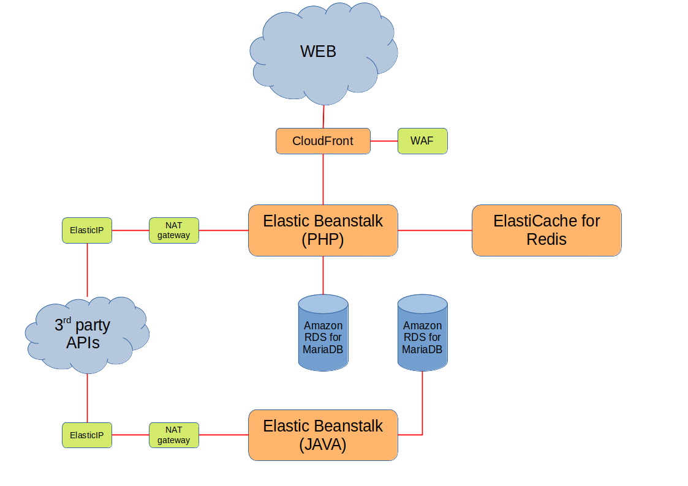

# challenge4
Tech challenge: On Prem to AWS. Design an AWS platform to migrate on prem infra to.

## Overview
Design an AWS platform to migrate the provided on prem infrastructure to. This should not be taken as an exercise in using every AWS product but as a platform that balances cost/performance/scalability/complexity.

## Goals
1. Produce an AWS architecture diagram for the scenario outlined,
2. Be able to explain and justify your design decisions during an interview.

## Specifications
It has been decided that an existing on premise platform should be moved to AWS. It is an ecommerce platform that sells digital products. Speed and reliability are the primary concerns but finding a cost effective solution is important. 
The proposed solution diagram should clearly show what AWS products are proposed and how they connect with each other. 

## Existing components
- 2 x HAProxy (WEB LB & API LB)
- 2 x MariaDB (content, settings & customer data)
- 10 x Apache HTTPD (PHP)
- 4 x Apache Tomcat (JAVA)
- 1 x Varnish (cache for CSS, js, images...)
- 1 x Redis (session storage)

## AWS architecture diagram

Please refer to [diagram.pdf](https://github.com/TME520/challenge4/blob/master/diagram.pdf) for a printable version.

## Explanation for the above diagram

- **CloudFront + WAF**: These two replace the Varnish cache. They provide a Content Delivery Network and a rules-based security system toi avoid, among other things, *DDoS*,
- **Elastic Beanstalk (PHP and JAVA)**: They replace the WEB servers and the API servers. They are a very convenient secure, scalable way to run PHP and Tomcat,
- **Elastic IP and NAT gateway**: They are required to allow the Elastic Beanstalk services to communicate with 3rd party APIs via single authorized IPs,
- **Amazon RDS for MariaDB**: They are a very scalable, cost-efficient, secure and performant way to replace the MariaDB servers,
- **ElastiCache for Redis**: Again, a very scalable, cost-efficient, secure and performant way to replace the Redis server.

I used as many managed services (*CloudFront*, *Elastic Beanstalk*, *Amazon RDS*, *ElastiCache*) as possible in this infrastructure, because they are a very good way to offload toil to Amazon and free up a lot of time for your local tech team to work on deep trouble shooting and improvements.

Here is a list of the repetitive, time-consuming tasks that using managed services gets you rid of:

- System updates,
- Security patching,
- Services updates (MariaDB, Varnish...),
- Maintenance-related downtime,
- Fine-tuning autoscaling,
- Firefighting *DDoS**.

All of the above is known to slow down and sometimes prevent systems and application maintenance, creating tech debt and unmanageable legacy services.